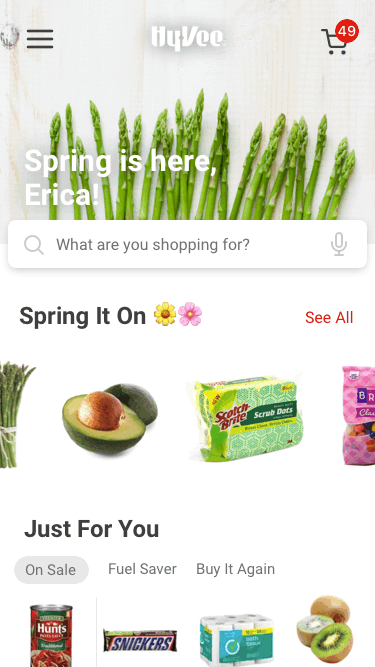

## Problem

We saw continually increasing mobile web traffic on Hy-Vee Aisles Online, but the majority of conversions still took place on desktop. We suspected that a native mobile app would better serve our customers through improved usability and by adapting to their busy lifestyles.

## Role

As the lone UI/UX designer for the app, I was responsible for all things design-related: user research and testing, wireframing, visual design and content strategy. I collaborated with engineering teammates and senior leadership to drive user-centered outcomes and ensure design fidelity.

	
	

## Process

Existing UX research and customer feedback around Aisles Online pointed to opportunities to significantly reduce users' cognitive load when shopping the site. Based on these findings, I centered the app's design around 1) minimal cognitive load, 2) ease of use and 3) speed to checkout.

We began every new feature or workflow by also articulating a clear goal for users. I then tested Sketch prototypes against that goal to arrive at an optimal solution prior to handing off any development work.

## Solution

Thanks to extensive user testing and beta user feedback during development, we delivered an app that makes it easy to shop and check out quickly from anywhere. Customers frequently comment that they now shop for groceries while at sporting events, spin class or from their couch.

## Challenges

We often faced competing business priorities and user goals while designing the app. One concept allowed users to toggle between different modes of shopping: online vs in-store. While we thought this would help the app serve a greater number of customers, it ultimately proved very confusing and disorienting to users.

## Outcomes

The app released to very strong organic growth and daily usage. Early app store reviews and customer feedback have been largely positive, especially around usability and checkout speed.

> "Love the ease of use when it comes to building a list by scanning what is being used at our home, scanning the barcode of what is almost empty, or simply pulling from my recent purchases!"

## Reflection

We continually saw the importance of challenging our assumptions through user-centered testing and feedback during the development of the app. While initially difficult given our tight agile cycles, this eventually made our small team much more efficient and drove a clearer roadmap and strategy for the app. It also resulted in better customer outcomes and adoption rates from initial launch.

## Download

[Hy-Vee Aisles Online (iOS)](https://apps.apple.com/us/app/hy-vee-aisles-online/id1401371704)

[Hy-Vee Aisles Online (Android)](https://play.google.com/store/apps/details?id=com.hyvee.grocery&hl=en_US)
